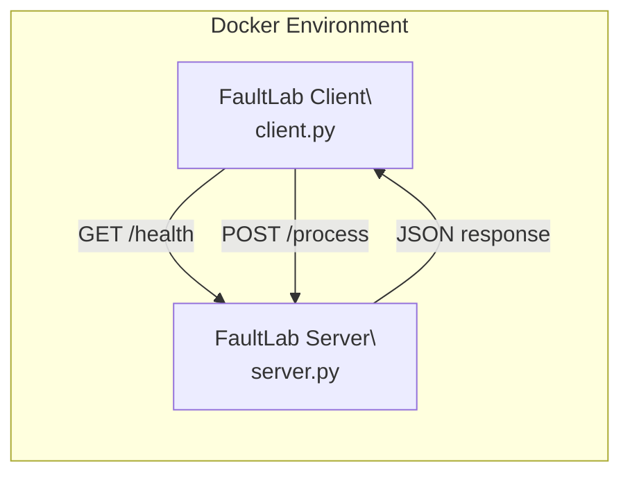
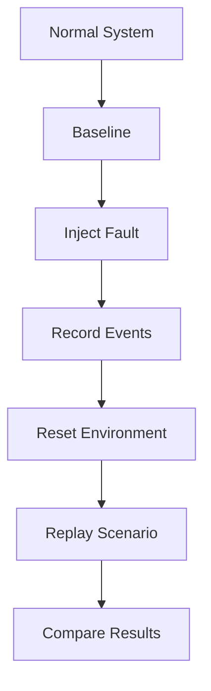
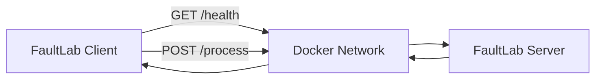

# FaultLab

FaultLab is a Docker-based Linux network fault injection, recording, and replay framework for reproducible testing of client-server applications.

The project is designed to test how a client-server application behaves under controlled failures such as network delay, packet loss, temporary disconnection, and process failure.

## Intended Workflow

**Normal System → Baseline → Inject → Record → Reset → Replay → Compare**

## Current Status

The initial client-server test environment is working.

### Implemented

- Python Flask server
- Python client
- `/health` endpoint for server health checking
- `/process` endpoint with predictable request/response behavior
- Dockerized server
- Dockerized client
- Docker Compose configuration
- Shared Docker network between client and server
- Successful client-to-server communication inside Docker

### Successful Test

- Health response: `{'status': 'healthy'}`
- Process response: `{'request_id': 'req-001', 'result': 20, 'status': 'success'}`

The fault injection, recording/replay, baseline automation, reset workflow, and comparison components are still under development.

## Current Architecture

Docker Compose provides the shared network between the client and server.

Inside Docker, the client reaches the server at `http://server:5000`.

The name `server` comes from the Docker Compose service name.

## Test Workload

### GET `/health`

The `/health` endpoint verifies that the server is running and reachable.

Example response:

`{"status": "healthy"}`

### POST `/process`

The `/process` endpoint provides a small, predictable workload for FaultLab experiments.

Example request:

`{"request_id": "req-001", "value": 10}`

Example response:

`{"request_id": "req-001", "status": "success", "result": 20}`

The server currently doubles the provided value. This gives the team a predictable expected result that can later be compared before, during, and after injected faults.

## Running the Current System

### Requirements

Install:

- Git
- Docker Desktop
- Docker Compose

Python is only required if the client or server is being run directly outside Docker.

### Start the Docker Environment

From the root of the repository, run:

`docker compose up --build`

A successful run should show:

- `faultlab-client | Health: {'status': 'healthy'}`
- `faultlab-client | Process: {'request_id': 'req-001', 'result': 20, 'status': 'success'}`

The client exits after completing its requests.

The server remains available until the Docker environment is stopped.

### Stop the Environment

Press `CTRL + C`.

Then clean up the containers and network with:

`docker compose down`

## Project Structure

- `client/`
  - `client.py`
  - `Dockerfile`
- `server/`
  - `server.py`
  - `Dockerfile`
- `compose.yaml`
- `requirements.txt`
- `README.md`
- `.gitignore`

## Team Responsibilities

### Dubem Akukwe

**Network Environment and Integration Lead**

Primary responsibilities:

- Docker client/server test environment
- Repeatable baseline workload
- Reset workflow
- Health checks
- System integration
- End-to-end testing
- Release setup
- Integration of the fault-injection and recording/replay components

Current progress:

- Basic Python client/server workload completed
- Server health check completed
- Predictable `/process` workload completed
- Client Docker image completed
- Server Docker image completed
- Docker Compose environment completed
- Docker client-to-server communication verified

### Fidel Anyanwu

**Fault Injection and Scenario-Control Lead**

Primary responsibilities:

- Linux traffic control
- `tc/netem`
- Latency injection
- Packet-loss injection
- Connection disruption
- Process faults
- Timed fault execution
- Scenario control
- Fault cleanup and recovery

The current Docker client/server environment is ready for initial fault-injection development.

Suggested branch: `fidel/fault-injection`

### Chidera Chuka

**Recording, Replay, and Evaluation Lead**

Primary responsibilities:

- Experiment event recording
- Run IDs
- Timestamps
- Recording scheduled and observed fault events
- Replaying saved scenarios
- Comparing original and replay runs
- Reproducibility evaluation
- Recording differences between expected and observed behavior

The shared scenario and event formats will be defined as the fault-injection and recording components begin integration.

Suggested branch: `chidera/record-replay`

## Git Workflow

Development should not be performed directly on `main`.

Each team member should work on a separate branch.

Suggested branches:

- `dubem/test-environment`
- `fidel/fault-injection`
- `chidera/record-replay`

Workflow:

1. Create or switch to your branch.
2. Make changes.
3. Test the changes.
4. Commit the changes.
5. Push the branch.
6. Open a pull request.
7. Review the pull request.
8. Merge into `main`.

The `main` branch should represent the most stable integrated version of FaultLab.

## Planned FaultLab Workflow

### Normal System

Start the Docker client/server environment and confirm that the application works correctly without faults.

### Baseline

Run the workload under normal conditions and record expected behavior such as:

- Successful requests
- Response values
- Response times
- Errors
- Recovery state

### Inject

Apply controlled faults such as:

- Latency
- Packet loss
- Temporary connection disruption
- Process interruption

### Record

Record the fault scenario and experiment events, including timing and observed behavior.

### Reset

Return the test environment to a known healthy state before another experiment.

### Replay

Reapply a previously recorded scenario using the same event order and timing information.

### Compare

Compare the original experiment with the replay to evaluate how consistently the same failure behavior can be reproduced.

## Planned Development Milestones

1. Baseline measurement and logging
2. Initial latency fault injection
3. Packet-loss fault injection
4. Process or connection disruption
5. Shared scenario format
6. Experiment event recording
7. Reset and cleanup workflow
8. Scenario replay
9. Original-versus-replay comparison
10. Integration testing
11. Documentation and release setup

The first priority is to complete a working minimum viable FaultLab system before adding optional features.

## Minimum Viable FaultLab

The minimum working version of FaultLab should support:

- Docker-based client/server environment
- Predictable baseline workload
- Latency fault
- Packet-loss fault
- One process or connection disruption
- Fault recording
- Environment reset
- Scenario replay
- Comparison between original and replay behavior

Additional features should only be added after the minimum system works reliably.

## Current Development Checkpoint

The current working system is:

The client and server are both running in Docker containers and successfully communicating through the Docker network.

This provides the shared test environment required for the next phase of FaultLab development.
"""

path = Path("/mnt/data/README.md")
path.write_text(content, encoding="utf-8")
print(f"Created {path}")
